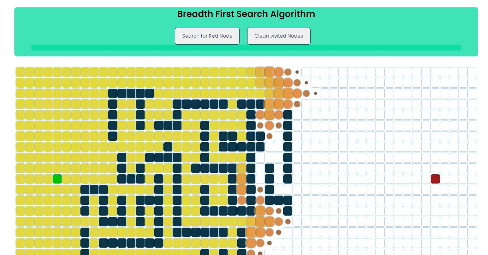
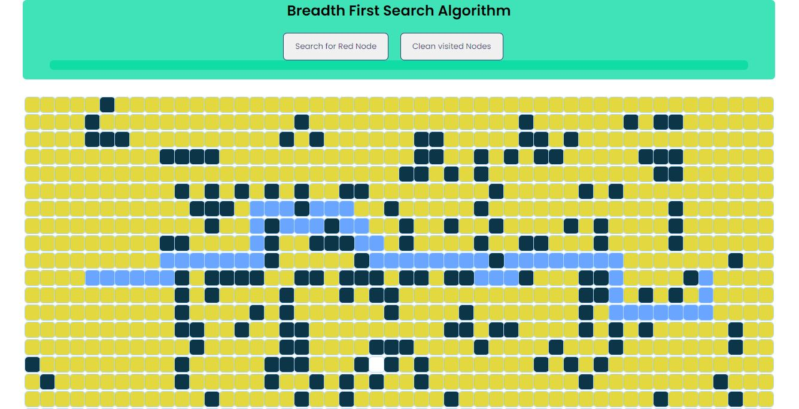
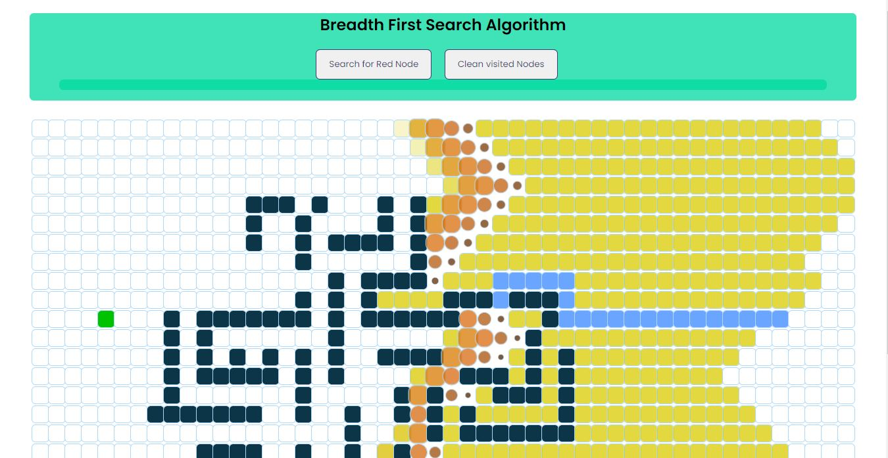

<section align="center">
  <h2>Breadth First Search Algorithm</h2>

  https://breadth-first-search-algorithm.netlify.app

  The Breadth First Search Algorithm has 3 stages, the first stage is when the algorithm is still searching for the red node. 
  The Second stage is when the algorithm finds the red node, and it determines the shortest path.
  The third and last stage, is when the User presses the clean nodes button, when the algorithm will clean all the visited nodes
  and be able to start afresh and draw a different wall.
  

  <h3>Stage 1</h3>
  
  

  <h3>Stage 2</h3>
  
  

  <h3>Stage 3</h3>
  
</section>
